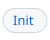

# The FFI

[Overview](#overview) | [Calling a guest from make](#calling-a-guest-from-make) | [Calling make from a guest](#calling-make-from-a-guest) | [Events](#events) | [Processes](#processes) | [Output](#output) | [Per-engine notes](#per-engine-notes) | [Engine API](#engine-api)

<!-- header overview "Overview" | Directions #directions-of-the-bridge | Features #features-and-version-info -->
<p align="right"><a id="overview"></a><a href="#overview"><picture><source media="(prefers-color-scheme: dark)" srcset="img/hdr/docs-ffi.overview.title.dark.svg"></picture></a><a href="#directions-of-the-bridge"><picture><source media="(prefers-color-scheme: dark)" srcset="img/hdr/docs-ffi.overview.0.dark.svg"></picture></a><a href="#features-and-version-info"><picture><source media="(prefers-color-scheme: dark)" srcset="img/hdr/docs-ffi.overview.1.dark.svg"></picture></a><br clear="all"><picture><source media="(prefers-color-scheme: dark)" srcset="img/hdr/_rule.dark.svg"></picture></p>
<!-- /header -->

### Directions of the bridge

### Features and Version Info

`.FEATURES` is a standard builtin var for `make` which `amk` honors and extends.  You can consult to find out what's available in the current runtime, for use with `ifeq..endefs` guards and so on.  Default values with the default `amk` build would include default engine names, e.g. `awk jq lua s7 micropy js`, plus e.g. `wasm` if/when it is built in.

`.ENGINES` is similar, but `amk` specific, thus the *mere presence* can confirm/deny whether the runtime is `amk`.  

Also available and related.. `.AMK_VERSION` carries amk's own version, while `$(MAKE_VERSION)` stays make's.

From the CLI, `--version` details everything like so:

```
GNU Make 4.4.1
Built for x86_64 and aarch64 as an actually portable executable (amk 0.1.0: awk jq lua s7 micropy js)
```

Typical pattern for guards is something like:

```make
ifneq ($(filter jq,$(.FEATURES)),)
  version := $(jq.argv -r,.version,$(file < package.json))
else
  version := $(shell jq -r .version package.json)
endif
```

#### Capabilities by Engine

The goal is a unified interface for all engines, but what can be done easily depends on what the upstream embedded projects actually expose.  Among other things, the variations on this theme includes questions like

* CLI / argv exposed for runtime config, or code only?
* Exec vs Eval: persistent kernel or one-shot only?
* Singleton kernel or many possible?

The most interesting question is around whether FFI is *bidirectional* yet, i.e. whether `amk` can simply run the guest or if the guest can actually reach into the `amk` runtime to change it, or possibly to *call other guests*.

This table tracks the current breakdown of per-engine support:

| engine | `$(name ...)` | `.argv` | `.import.target` | `.exec` | init | hooks | handle reads | handle writes | `amk.func` | `.import` |
| --- | --- | --- | --- | --- | --- | --- | --- | --- | --- | --- |
| awk | yes | yes | yes | - | - | - | - | - | - | - |
| jq | yes | yes | yes | store | yes | - | - | - | - | - |
| lua | yes | - | yes | yes | yes | yes | yes | yes | yes | yes |
| s7 | yes | - | yes | yes | yes | yes | yes | yes | yes | yes |
| micropy | yes | - | yes | yes | yes | yes | yes | yes | yes | yes |
| js | yes | - | yes | yes | yes | yes | yes | yes | yes | yes |
| wasm | module | yes | - | - | - | - | - | - | - | - |

Handle reads are `amk.var` and `amk.expand`; handle writes are `amk.var` assignment and
`amk.eval`. Init, hooks, `amk.func`, and `.import` all need a kept state, so a row gains
them together once it has one. jq is the exception: its kept state is one JSON value, the
store, which runs an init chunk but has no hooks or handle.

<!-- header calling-a-guest-from-make "Calling a guest from make" | Persistent state #persistent-state | jq store #the-jq-store | Init #init | Goal values #values-between-goals | Job stdin #feeding-a-jobs-standard-input | Recipe calls #calls-from-a-recipe -->
<p align="right"><a id="calling-a-guest-from-make"></a><a href="#calling-a-guest-from-make"><picture><source media="(prefers-color-scheme: dark)" srcset="img/hdr/docs-ffi.calling-a-guest-from-make.title.dark.svg"></picture></a><a href="#persistent-state"><picture><source media="(prefers-color-scheme: dark)" srcset="img/hdr/docs-ffi.calling-a-guest-from-make.0.dark.svg"></picture></a><a href="#the-jq-store"><picture><source media="(prefers-color-scheme: dark)" srcset="img/hdr/docs-ffi.calling-a-guest-from-make.1.dark.svg"></picture></a><a href="#init"><picture><source media="(prefers-color-scheme: dark)" srcset="img/hdr/docs-ffi.calling-a-guest-from-make.2.dark.svg"></picture></a><a href="#values-between-goals"><picture><source media="(prefers-color-scheme: dark)" srcset="img/hdr/docs-ffi.calling-a-guest-from-make.3.dark.svg"></picture></a><a href="#feeding-a-jobs-standard-input"><picture><source media="(prefers-color-scheme: dark)" srcset="img/hdr/docs-ffi.calling-a-guest-from-make.4.dark.svg"></picture></a><a href="#calls-from-a-recipe"><picture><source media="(prefers-color-scheme: dark)" srcset="img/hdr/docs-ffi.calling-a-guest-from-make.5.dark.svg"></picture></a><br clear="all"><picture><source media="(prefers-color-scheme: dark)" srcset="img/hdr/_rule.dark.svg"></picture></p>
<!-- /header -->

#### Passing programs and input

make expands `$` and splits on commas before an engine sees its arguments:

```make
# inline: a literal $ is written $$
shout := $(awk { print toupper($$0) },hello)

# inline: commas inside ( ) are safe
head := $(awk BEGIN { print substr("hello", 1, 4) })

# a top-level comma would end the program early, so the program goes in a define
define awk.pair
BEGIN { printf "%s-%s", "a", "b" }
endef
pair := $(awk $(value awk.pair))

# $(value) passes a define raw, so $2 stays $2
define awk.second
{ print $2 }
endef
second := $(awk $(value awk.second),alpha beta gamma)
```

`shout` is `HELLO`, `head` is `hell`, `pair` is `a-b`, and `second` is `beta`. Braces do
not protect a comma the way parentheses do, and the last argument, the input, may hold
any commas.

<a id="star-forms"></a>
#### Star forms

Every engine builtin has a twin whose name ends in `*`. Each argument of the twin that
names a variable becomes that variable's unexpanded value, dedented; any other argument
passes as written. A define needs no `$(value)`, and its `$` and commas reach the engine
as typed:

```make
define lua.count
  local n = 0
  for line in io.lines() do
    for _ in line:gmatch("%S+") do n = n + 1 end
  end
  print(n)
endef
words := the quick brown fox

# both arguments name variables: 4
count := $(lua* lua.count, words)

# the input names no variable, so it is text: 2
pair := $(lua* lua.count, one two)

# -r names no variable and stays an option; prog and doc are read
name := $(jq.argv* -r, prog, doc)
```

A value with a line indented less than the body's base indent is fatal. `$(amk.dedent* x)`
follows the same rule, and `$(<name>.import.target* var)` with one argument takes the
target's name and its body from the one variable.

### Persistent state

`$(<name>.exec program)` runs in the make process against a state kept for the life of
that process, where `$(<name> ...)` forks a fresh one per call. A global one call sets is
there for the next, an error leaves the state as it was, and the result is what the chunk
prints, trimmed like every builtin's. The call takes one argument, so the program keeps
its commas. Per-call data reaches the chunk through `amk.var` and `amk.expand`, or through
the star form, which runs a variable's text. Under a zygote the state is forked with the
parse, so each request starts from what the parse left. lua, s7, micropy, and js have
`exec` and `import`; jq has `get`, `update` and `load`, see the store below.

Every engine has the namespace `main`, which `$(<name>.<op> ...)` runs in. `create` makes
another, with a state of its own, and a handle `ns.<op>` with its star twin for each of the
engine's operations:

```Makefile
$(lua.ns work, create)
$(work.exec x = 2)
$(lua.exec x = 1)
# 1 2
both := $(lua.exec print(x)) $(work.exec print(x))
# the same call through the general form, for a computed name
also := $(lua.ns work, exec, print(x))
```

A namespace is one word, belongs to the engine that created it, and lives for the make
process; `create` is idempotent and never resets it. A call on a name never created is
fatal, as is a `create` whose handle would shadow a make function. `create` runs before
the first expanded use, in a bare line or a `:=` above it; recipes expand later and are
always fine. micropy keeps one state, so `create` is refused there. Init chunks run in
`main`, hooks fire from `main`, and `amk.func` from any namespace registers into make's one
function table, where a name another namespace holds is refused.

A one-shot call runs in a forked child that inherits the parent's kept states, so each
engine's one-shot entry starts its own state and does not see it as kept.

### The jq store

A jq namespace is one JSON value held for the life of the make process, and jq programs
run over it in that process, with no fork. `main` is `$(jq.get ...)`, `$(jq.update ...)`
and `$(jq.load ...)`; `$(jq.ns name, create)` makes another value, `null` until written,
with the handles `name.get`, `name.update` and `name.load`:

| call | runs | stores | returns |
| --- | --- | --- | --- |
| `$(name.get PROG)` | the program over the value | nothing | every output |
| `$(name.update PROG)` | the program over the value | the first output | the rest |
| `$(name.load TEXT)` | | the one JSON text | nothing |

There is no stateless `filter` builtin: `$(jq PROG,TEXT)` runs the program over every JSON
text in the input, in this process, printing as the jq tool does.

Words before the program bind variables as the jq tool does, `--arg k v` for a string,
`--argjson k v` for a value, `--slurpfile k path` for every JSON text in a file as an
array and `--rawfile k path` for a file's text, and `-r` prints a string output bare. A
value with a space or a quote inside it travels quoted as a shell would write it, and
inside double quotes `\n` reads as a newline. A program compiles once
per text and set of bound names, so a loop that binds a new value each turn never
recompiles. A program error is a nonzero `.SHELLSTATUS` with jq's message on stderr, never
a make error, and the value stays as it was.

```Makefile
# a stack in the store: push, then pop the top and keep the rest
$(jq.ns stack, create)
seed  := $(stack.update [1] + [2])
push  := $(stack.update --argjson v 3 . + [$$v])
pop   := $(stack.update .[:-1], .[-1])
depth := $(stack.get length)
# a string output printed bare
$(jq.ns who, create)
name := $(who.update {"name": "a b"})
who  := $(who.get -r .name)
```

`pop` is `3`, `depth` is `2` and `who` is `a b`. An operation takes one argument, so a
comma at the top level of a program stays in the program: `update` stores the first output
and returns the rest, which is how a stream pops. Under a zygote each request starts from
the store the parse left.

### Init

Every engine with persistent state runs one chunk in that state before make reads any
makefile, in every make process, so what the chunk defines is present for the parse and a
hook it registers hears the first `goals` event. The chunk comes from `AMK_<NAME>_INIT`,
as text or as `@path`, or from `__init__.<name>` at the root of a bundled payload. Under a
zygote the chunk runs once and every request inherits the result, which is how a
distribution loads its guest code without paying for it per request. The lookup is per
engine, so `__init__.lua` and `__init__.micropy` would each go to their own state.

#### Defining a target in an engine

`@<engine>.import.target` above `define name` through `endef` makes the body a program
for that engine and the name a phony target that runs it on the job's own input and
output, every time. Only a target that some body references as `@name@` keeps its value,
in `$(goal.dir)/name`, `.amk/goals` by default, and its name prints that. With no
reference in any body, `goal.dir` is never read and no directory is made. An `@` line
with no define after it is an error at that line.

### Values between goals

`$(goal name)` answers the value of a goal: it brings the goal up to date, in a fork of
the parsed image the way the spawn api runs a goal list, then reads its value, trimmed
of one trailing newline like every builtin. An imported target's value is what its
program printed, kept or not. A plain file target has a value too, the file itself,
read where it is and never copied.

An imported body reaches its engine as written, so `$` is the guest's. Its one form is
`@x@`, the value of goal x spliced in raw: a name of letters, digits and `_ . - /`, in
any case, that must match exactly one target a makefile names; a file needs a rule,
even an empty one. Each is a prerequisite on x's value file, so a kept value reruns only
when a value it reads is newer, and independent targets run at once under `-j`. Names
resolve after the makefiles are read, so a reference may come first. `$(goal ...)`
belongs in recipes, and a plain rule names the goal as a prerequisite.

An imported target's job is a fork of make with no exec, so the guest handle reads make
state there; its writes end with the job. The fork splices the values into the program
and runs the engine on it, a kept value's output on its file. No file carries the
program and no argument limit bounds its size. A failed target keeps what it wrote, as
any recipe does, unless the makefile names `.DELETE_ON_ERROR:`.

### Feeding a job's standard input

`$(job.stdin text)` expands to nothing and feeds the text to the command on the recipe
line it appears in, through a pipe a detached helper fills, so the text may be any
size. The pipe is bound to that line of that target, so two lines each get their own
and targets that interleave under `-j` never cross. A line whose command never runs
drops its pipe when the target's job ends. Outside a recipe the function is an error.

Every text engine's flag form reads its program from standard input when its argument
is a lone dash: `amk --lua -`, and the same for s7, micropy, and js. awk and jq keep
their own command lines, so a recipe hands awk `-f -` and jq `-n -f /dev/stdin`, which
also gives jq the null input it needs to run without data.

### Calls from a recipe

A builtin expands before a recipe runs, so a value that changes while the recipe runs, a stack popped in a loop, needs a call at recipe time. Every make process names two descriptors to its recipes, `AMK_CALL` and `AMK_REPLY`, a request pipe and a reply pipe, and answers on them from the jq store while the recipe's shell runs. Everything is line framed and carries JSON as it is: a request is one line, the store call; a reply is a `STATUS N` line, then N lines, one output each. Shell builtins do the whole exchange, so a call costs a write and a read and never a fork:

```Makefile
define ask
printf '%s\n' "$(1)" >&$$AMK_CALL && read -r st n <&$$AMK_REPLY && { [ "$$n" = 0 ] || IFS= read -r $(2) <&$$AMK_REPLY; }
endef

drain:
	$(call ask,update S [3$(,) 1$(,) 2],x)
	while :; do $(call ask,update S .[:-1]$(,) .[-1],top); \
	  $(call ask,get S length,n); echo "popped $$top"; [ "$$n" != 0 ] || break; done
, := ,
```

The status is the store's, `0` when the program ran clean. A sub-make and a spawned job
hold no store of their own: each inherits a live pair and sends every request up it, its own
`$(jq.get ...)`, `$(jq.update ...)` and handle expansions included, so every process of a
run reads and writes the same entries. A name the channel uses exists on first use; the
builtins reach it through `$(jq.ns name, ...)` or after a `create` of their own. A request served by a zygote starts as an owner, from the store the parse left.

**Tags.** Recipe shells of one process share its pair, so two callers running at once, two
stages of one pipeline or two lines under `-j`, would read each other's replies. A request
that opens with `@TAG` is answered instead into a private FIFO, `$AMK_REPLY_DIR/TAG`, which
the answering process makes and removes; one empty line on `AMK_REPLY` says the FIFO is
there before the caller opens it. `$BASHPID` is a tag no other caller holds. Hops forked
from one parse share the directory, and the one that answers after a sibling took it down
makes it again.

**The shell side, once.** `amk.sh` sits on `PATH` beside the payload tools, so a recipe
runs `source amk.sh` and has two functions. `amk.call REQUEST [LINE...]` sends a tagged
request, with input lines after it, prints the reply lines and returns the status.
`jq.pipe [OPTS] PROG` reads stdin and runs the program over it in the make process, so a
pipeline converts by replacing the command word:

```Makefile
names:
	source amk.sh; printf '{"n":"a"}\n{"n":"b"}\n' | jq.pipe -r .n | sort -r
	source amk.sh; amk.call 'get S length'
```

`jq.pipe` sends `filter N [OPTS] PROG` and then N input lines; the outputs come back as
jq would print them. OPTS is exactly `-r -c -e -n -s --arg --argjson --slurpfile
--rawfile`, and any other option is status 2 with nothing run, so a site that needs more
fails when it converts rather than later. `amk.words ARG...` writes its arguments as
words for a request line, so a caller building `get` or `update` by hand quotes its
option values with it and passes the program raw. jq's messages go to make's stderr.

<!-- header calling-make-from-a-guest "Calling make from a guest" | Guest handle #the-guest-handle | Expansion #expansion-and-variable-reads | Writes and eval #variable-writes-and-eval | Functions #registering-make-functions | Forked writes #writes-from-a-forked-guest -->
<p align="right"><a id="calling-make-from-a-guest"></a><a href="#calling-make-from-a-guest"><picture><source media="(prefers-color-scheme: dark)" srcset="img/hdr/docs-ffi.calling-make-from-a-guest.title.dark.svg"></picture></a><a href="#the-guest-handle"><picture><source media="(prefers-color-scheme: dark)" srcset="img/hdr/docs-ffi.calling-make-from-a-guest.0.dark.svg"></picture></a><a href="#expansion-and-variable-reads"><picture><source media="(prefers-color-scheme: dark)" srcset="img/hdr/docs-ffi.calling-make-from-a-guest.1.dark.svg"></picture></a><a href="#variable-writes-and-eval"><picture><source media="(prefers-color-scheme: dark)" srcset="img/hdr/docs-ffi.calling-make-from-a-guest.2.dark.svg"></picture></a><a href="#registering-make-functions"><picture><source media="(prefers-color-scheme: dark)" srcset="img/hdr/docs-ffi.calling-make-from-a-guest.3.dark.svg"></picture></a><a href="#writes-from-a-forked-guest"><picture><source media="(prefers-color-scheme: dark)" srcset="img/hdr/docs-ffi.calling-make-from-a-guest.4.dark.svg"></picture></a><br clear="all"><picture><source media="(prefers-color-scheme: dark)" srcset="img/hdr/_rule.dark.svg"></picture></p>
<!-- /header -->

### The guest handle

Lua, micropy, s7, and js each carry a handle into make: the same five calls, spelled the
way each language expects.

| | lua | micropy | s7 | js |
| --- | --- | --- | --- | --- |
| read | `amk.var.CC`, `amk.var["a.b"]` | `amk.var.CC`, `amk.var["a.b"]` | `(amk-var 'CC)`, `(amk-var "a.b")` | `amk.var.CC`, `amk.var["a.b"]` |
| write | `amk.var.CC = "cc"` | `amk.var.CC = "cc"` | `(set! (amk-var 'CC) "cc")` | `amk.var.CC = "cc"` |
| expand | `amk.expand(text)` | `amk.expand(text)` | `(amk-expand text)` | `amk.expand(text)` |
| eval | `amk.eval(text)` | `amk.eval(text)` | `(amk-eval text)` | `amk.eval(text)` |
| call | `amk.call(name, ...)` | `amk.call(name, *values)` | `(amk-call 'name value ...)` | `amk.call(name, ...values)` |
| acall | `amk.acall(name, ...)`, a handle with `pid`, `fd`, and `result()` | `await amk.acall(name, *values)` | `(amk-call-begin 'name value ...)` answers `(pid fd)`, `(amk-call-end pid)` collects | `await amk.acall(name, ...values)` |
| undefined | `nil` | `None` | `#f` | `undefined` |

`amk` is bound in every state, so micropy needs no import, though `import amk` still
works. A dotted or hyphenated name goes through the item form, since attribute syntax
cannot spell it. Under an engine flag, `amk --lua ...`, there is no makefile and every
call of the handle raises.

```Makefile
CC := clang
flags = -O2 $(EXTRA)

# reads and expansion, from a one-shot call: clang, -O2, and 3
seen := $(lua print(amk.var.CC, amk.expand("$$(strip $$(flags))"), amk.expand("$$(words a b c)")))

# a write from a one-shot call lands once the call returns, so the next line sees it
$(micropy import amk; amk.var.EXTRA = "-g"; amk.eval("debug: ; @echo $$(flags)"))
now := $(flags)
```

`now` is `-O2 -g` and `debug` is a target.

Call runs a make function or macro, builtin, imported, or defined, with each value as one
whole argument: nothing in a value is split on commas or expanded, so a value from outside
the makefile is safe to pass. Expand on text built from the same value would run any
`$(...)` it holds. A builtin that expands its own arguments, such as `if` or `foreach`, reads
each value back as written, and values past a builtin's last argument join it with commas.
Too few values, or a name make has neither as a function nor as a variable, raises.

```Makefile
pair = [$1|$2]

# [x,y|$(shell id)], with nothing run: both values arrive whole
both := $(micropy import amk; print(amk.call("pair", "x,y", "$$(shell id)")))

# a;b, from the builtin with a comma in a value
swapped := $(lua print(amk.call("subst", ",", ";", "a,b")))
```

### Expansion and variable reads

A read of a variable answers it expanded as a reference would be, and answers the
language's own nothing for a name make has never seen, which expansion alone cannot say.
Expand runs any text through make, functions included.

### Variable writes and eval

A write defines a simple variable holding the literal text, at file origin, so a
command-line override still wins. Eval reads text as makefile syntax, rules included. A
[persistent](#persistent-state) call runs in the make process and its writes apply at
once, visible to the same chunk's expand.

### Registering make functions

`amk.func(name, fn)`, or `(amk-func 'name fn)` in s7, from the persistent state of lua,
s7, micropy, or js, gives make a
function `$(name ...)`: its arguments, expanded, reach `fn` as strings, and what `fn`
returns is the result. A nil, None, undefined, or null result is empty, an error reports
on stderr and answers empty, and a second `amk.func` of the same name replaces the
function. A name make already has, builtin or otherwise, is refused. As with any make
function, a call needs at least a space after the name, since `$(name)` alone is a
variable reference.

```Makefile
$(lua.exec amk.func("shout", function(s) return s:upper() end))
$(micropy.exec amk.func("glue", lambda *a: "+".join(a)))

# make functions now: HELLO, and A+B
loud := $(shout hello)
joined := $(shout $(glue a,b))
```

`$(<name>.import chunk)` does the same without the calls: it runs the chunk in the
persistent state and imports every global the chunk defined or rebound, a callable as a
make function and any other value as a simple variable, in name order. A string or
number is its text, a boolean is `true` or empty, a list or array is its items as words,
and a table, dict, or object is one variable per key as `name.key`, recursing. A leading
underscore keeps a name private, as do nil, None, null, undefined, modules, and classes.
In js only `var` and function declarations reach the global object; `let` and `const` do
not, and a chunk that looks like a module is not exported at all. The result is the
imported names, and whatever the chunk prints goes to stderr. The star form,
`$(<name>.import* var)`, takes a variable's name instead of the chunk and hands over its
unexpanded value, dedented, as every [star form](#star-forms) does.

```Makefile
define micropy.build
cc = "clang"
flags = ["-O2", "-Wall"]
debug = True
targets = {"lib": "core c", "app": "core c ui"}
def shorten(s): return s[:3]
endef
built := $(micropy.import* micropy.build)

# cc debug flags shorten targets.app targets.lib, and clang -O2 -Wall true lib: core c
summary := $(cc) $(flags) $(debug) $(shorten library): $(targets.lib)
```

### Writes from a forked guest

A one-shot call runs in a forked child, so its writes are queued and applied, in order,
when the call completes; the chunk that made them cannot read them back, so it keeps its
own copy of anything it needs again.

<!-- header events "Events" | Hooks #hooks | Goal and recipe events #the-goal-list-and-recipe-events -->
<p align="right"><a id="events"></a><a href="#events"><picture><source media="(prefers-color-scheme: dark)" srcset="img/hdr/docs-ffi.events.title.dark.svg"></picture></a><a href="#hooks"><picture><source media="(prefers-color-scheme: dark)" srcset="img/hdr/docs-ffi.events.0.dark.svg"></picture></a><a href="#the-goal-list-and-recipe-events"><picture><source media="(prefers-color-scheme: dark)" srcset="img/hdr/docs-ffi.events.1.dark.svg"></picture></a><br clear="all"><picture><source media="(prefers-color-scheme: dark)" srcset="img/hdr/_rule.dark.svg"></picture></p>
<!-- /header -->

### Hooks

make announces three moments: `goals`, once the goal list is known, and `recipe_start`
and `recipe_end` around each target's recipe. Every engine with a hook entry hears them
with the event name, the target or the space-joined goals, the recipe's status word and
exit code, the signal, and the pid. The spelling is each language's own: lua, a function
at `amk.on.<event>` called with a table; micropy, a callable at `amk.on["<event>"]`
called with a dict; js, a function at `amk.on.<event>` called with an object; s7, a
procedure set with `(set! (amk-on 'event) fn)` and called with a let. The keys are
`event`, `target`, `status`, `code`, `signal`, and `pid` in all four. Hooks observe
and cannot veto a recipe. What a hook prints goes to stderr, and an error in a hook is
reported there and does not stop make.

### The goal list and recipe events

<!-- header processes "Processes" | Spawn #spawn | Wait and kill #wait-kill-and-foreground | Captured stdout #captured-standard-output | Mail #mail -->
<p align="right"><a id="processes"></a><a href="#processes"><picture><source media="(prefers-color-scheme: dark)" srcset="img/hdr/docs-ffi.processes.title.dark.svg"></picture></a><a href="#spawn"><picture><source media="(prefers-color-scheme: dark)" srcset="img/hdr/docs-ffi.processes.0.dark.svg"></picture></a><a href="#wait-kill-and-foreground"><picture><source media="(prefers-color-scheme: dark)" srcset="img/hdr/docs-ffi.processes.1.dark.svg"></picture></a><a href="#captured-standard-output"><picture><source media="(prefers-color-scheme: dark)" srcset="img/hdr/docs-ffi.processes.2.dark.svg"></picture></a><a href="#mail"><picture><source media="(prefers-color-scheme: dark)" srcset="img/hdr/docs-ffi.processes.3.dark.svg"></picture></a><br clear="all"><picture><source media="(prefers-color-scheme: dark)" srcset="img/hdr/_rule.dark.svg"></picture></p>
<!-- /header -->

### Spawn

### Wait, kill, and foreground

### Captured standard output

### Mail

<!-- header output "Output" | Sinks #sinks | Stdout capture #standard-output-capture -->
<p align="right"><a id="output"></a><a href="#output"><picture><source media="(prefers-color-scheme: dark)" srcset="img/hdr/docs-ffi.output.title.dark.svg"></picture></a><a href="#sinks"><picture><source media="(prefers-color-scheme: dark)" srcset="img/hdr/docs-ffi.output.0.dark.svg"></picture></a><a href="#standard-output-capture"><picture><source media="(prefers-color-scheme: dark)" srcset="img/hdr/docs-ffi.output.1.dark.svg"></picture></a><br clear="all"><picture><source media="(prefers-color-scheme: dark)" srcset="img/hdr/_rule.dark.svg"></picture></p>
<!-- /header -->

### Sinks

### Standard output capture

<!-- header per-engine-notes "Per-engine notes" | lua #lua | s7 #s7 | micropy #micropy | js #js | wasm #wasm -->
<p align="right"><a id="per-engine-notes"></a><a href="#per-engine-notes"><picture><source media="(prefers-color-scheme: dark)" srcset="img/hdr/docs-ffi.per-engine-notes.title.dark.svg"></picture></a><a href="#lua"><picture><source media="(prefers-color-scheme: dark)" srcset="img/hdr/docs-ffi.per-engine-notes.0.dark.svg"></picture></a><a href="#s7"><picture><source media="(prefers-color-scheme: dark)" srcset="img/hdr/docs-ffi.per-engine-notes.1.dark.svg"></picture></a><a href="#micropy"><picture><source media="(prefers-color-scheme: dark)" srcset="img/hdr/docs-ffi.per-engine-notes.2.dark.svg"></picture></a><a href="#js"><picture><source media="(prefers-color-scheme: dark)" srcset="img/hdr/docs-ffi.per-engine-notes.3.dark.svg"></picture></a><a href="#wasm"><picture><source media="(prefers-color-scheme: dark)" srcset="img/hdr/docs-ffi.per-engine-notes.4.dark.svg"></picture></a><br clear="all"><picture><source media="(prefers-color-scheme: dark)" srcset="img/hdr/_rule.dark.svg"></picture></p>
<!-- /header -->

### lua

### s7

The persistent state is one interpreter kept for the process. A chunk is read in the
rootlet under a catch, so every top-level `define` persists and an error reports on
stderr with the state left as it was.
The handle is `amk-expand`, `amk-eval`, `(amk-func 'name fn)`, and two dilambdas, so
`(set! (amk-var 'CC) "cc")` writes a variable and `(set! (amk-on 'goals) (lambda (e)
...))` subscribes a hook; the event is a let, read as `(e 'target)`. Output is captured
at the descriptor and reaches the sink when the chunk ends. Export walks the rootlet: a
procedure becomes a make function, a list or vector its items as words, a hash table or
let one variable per key, `#t` is `true` and `#f` empty, and a string, symbol, or number
its text.

### micropy

### js

The persistent state is one QuickJS runtime and context kept for the process, with the
std and os modules bound as globals and `amk` built by a prelude over raw C calls, so
`amk.var` is a Proxy and `amk.on` a plain object. Output is captured at the descriptor,
since `print` and `std.out` write it directly, and reaches the sink when the chunk ends.
A persistent chunk that looks like a module runs as one; an export chunk always runs as a
global script, since a module's top level never reaches the global object. Pending jobs
and timers run after each chunk, as they do after a one-shot call.

### wasm

<!-- header engine-api "Engine API" | Builtins #builtins | Grammar #grammar | Variables #variables | Guest handle #guest-handle | Init #recipe-environment-and-init | Command line #command-line -->
<p align="right"><a id="engine-api"></a><a href="#engine-api"><picture><source media="(prefers-color-scheme: dark)" srcset="img/hdr/docs-ffi.engine-api.title.dark.svg"></picture></a><a href="#builtins"><picture><source media="(prefers-color-scheme: dark)" srcset="img/hdr/docs-ffi.engine-api.0.dark.svg"></picture></a><a href="#grammar"><picture><source media="(prefers-color-scheme: dark)" srcset="img/hdr/docs-ffi.engine-api.1.dark.svg"></picture></a><a href="#variables"><picture><source media="(prefers-color-scheme: dark)" srcset="img/hdr/docs-ffi.engine-api.2.dark.svg"></picture></a><a href="#guest-handle"><picture><source media="(prefers-color-scheme: dark)" srcset="img/hdr/docs-ffi.engine-api.3.dark.svg"></picture></a><a href="#recipe-environment-and-init"><picture><source media="(prefers-color-scheme: dark)" srcset="img/hdr/docs-ffi.engine-api.4.dark.svg"></picture></a><a href="#command-line"><picture><source media="(prefers-color-scheme: dark)" srcset="img/hdr/docs-ffi.engine-api.5.dark.svg"></picture></a><br clear="all"><picture><source media="(prefers-color-scheme: dark)" srcset="img/hdr/_rule.dark.svg"></picture></p>
<!-- /header -->

## Builtins

| form | direction | engines | patch |
| --- | --- | --- | --- |
| `$(<engine_name> program[,input])` | make to guest | all; wasm takes a module | [0002] |
| `$(<engine_name>.argv args...)` | make to guest | awk, jq, wasm | [0002], [0011] |
| `$(<builtin>* args...)` | make to guest | every engine builtin | [0038], [0057] |
| `$(<engine_name>.exec chunk)`, `$(<engine_name>.ns name, op[, chunk])`, `$(name.<op> chunk)` | make to guest | lua, s7, micropy, js | [0018], [0028], [0030], [0031], [0063] |
| `$(jq.<op> program)`, `$(jq.ns name, op[, program])`, `$(name.<op> program)` | make to guest | jq: `get`, `update`, `load` | [0046], [0063] |
| `$(<engine_name>.import chunk)` | guest to make | lua, s7, micropy, js | [0029] |
| `$(goal name)` | make | any | [0032] |
| `$(job.stdin text)` | make to recipe | any | [0033] |
| `$(amk.require names...)` | make | any | [0036] |
| `$(amk.dedent text)`, `$(amk.val.dedent var)`, `$(amk.dedent* var)` | make | any | [0037], [0038] |
| `$(amk.fxns? engines...)`, `$(amk.vars? engines...)` | make | lua, s7, micropy, js | [0040], [0059] |

## Grammar

| form | direction | engines | patch |
| --- | --- | --- | --- |
| `@<engine_name>.import.target` above `define` | make to guest | all | [0039], [0042], [0044] |
| `@name@` in an imported body | goal to guest | all | [0043] |
| `__main__` target | make | any | [0035] |

## Variables

| form | direction | engines | patch |
| --- | --- | --- | --- |
| `.FEATURES`, `.ENGINES` | make | all | [0002] |
| `.AMK_VERSION`, `<engine_name>.__version__` | make | all | [0016], [0045] |
| `<engine_name>.__fxns__`, `<engine_name>.__vars__`, `amk.__fxns__`, `amk.__vars__` | make | lua, s7, micropy, js | [0040] |

## Guest handle

| form | direction | engines | patch |
| --- | --- | --- | --- |
| `amk.var` read and write | guest to make | lua, s7, micropy, js | [0027] |
| `amk.expand` | guest to make | lua, s7, micropy, js | [0027] |
| `amk.eval` | guest to make | lua, s7, micropy, js | [0027] |
| `amk.call(name, values...)` | guest to make | lua, s7, micropy, js | [0058] |
| `amk.acall(name, values...)`: the call in a fork, collected through the guest's own reactor | guest to make | lua, s7, micropy, js | [0061] |
| `amk.func` | guest to make | lua, s7, micropy, js | [0018] |
| `amk.on`: `goals`, `recipe_start`, `recipe_end` | make to guest | lua, s7, micropy, js | [0019] |
| `amk.spawn(goals[, opts])` | guest to make | lua | [0020], [0023] |
| `amk.wait([pid[, block]])` | guest to make | lua | [0020], [0024] |
| `amk.kill`, `amk.foreground` | guest to make | lua | [0021] |
| `amk.send(text)` | job to parent | lua | [0024] |
| `amk.exit_code(n)` | guest to make | lua | [0050] |

## Recipe environment and init

| form | direction | engines | patch |
| --- | --- | --- | --- |
| `AMK_MAIL` | job to parent | any | [0024] |
| `AMK_CALL`, `AMK_REPLY`, `amk.call`, `amk.words`, `jq.pipe` | recipe to make | jq store | [0047] |
| `AMK_<ENGINE_NAME>_INIT`, `__init__.<engine_name>` | make to guest | jq, lua, s7, micropy, js | [0022] |
| `__init__.mk`, `AMK_NO_PRELUDE` | make | any | [0034] |

## Command line

| form | direction | engines | patch |
| --- | --- | --- | --- |
| `--<engine_name>`, multi-call names, `--<engine_name> -` | shell to guest | all | [0003], [0033] |
| `--list-engines`, `--version`, `--help` | shell | all | [0003], [0016], [0017] |
| `--serve`, `--client` | shell to make | any | [0001] |
| `--bundle`, `--ape-unpack` | shell | any | [0008], [0013] |

[0001]: ../patches/0001-socket-mode.patch
[0002]: ../patches/0002-builtins.patch
[0003]: ../patches/0003-multicall.patch
[0008]: ../patches/0008-ape-unpack.patch
[0011]: ../patches/0011-wasm3.patch
[0013]: ../patches/0013-bundle.patch
[0016]: ../patches/0016-version.patch
[0017]: ../patches/0017-usage.patch
[0018]: ../patches/0018-api-persistent.patch
[0019]: ../patches/0019-api-hooks.patch
[0020]: ../patches/0020-api-spawn.patch
[0021]: ../patches/0021-api-signals.patch
[0022]: ../patches/0022-api-init.patch
[0023]: ../patches/0023-api-spawn-stdout.patch
[0024]: ../patches/0024-api-mail.patch
[0027]: ../patches/0027-api-var.patch
[0028]: ../patches/0028-micropy-persistent.patch
[0029]: ../patches/0029-api-export.patch
[0030]: ../patches/0030-js-persistent.patch
[0031]: ../patches/0031-s7-persistent.patch
[0032]: ../patches/0032-api-goal.patch
[0033]: ../patches/0033-api-job-stdin.patch
[0034]: ../patches/0034-prelude.patch
[0035]: ../patches/0035-main-goal.patch
[0036]: ../patches/0036-api-require.patch
[0037]: ../patches/0037-api-dedent.patch
[0038]: ../patches/0038-api-star.patch
[0039]: ../patches/0039-grammar-at.patch
[0040]: ../patches/0040-api-bindings.patch
[0042]: ../patches/0042-import-fork.patch
[0043]: ../patches/0043-grammar-goal-ref.patch
[0044]: ../patches/0044-import-kept.patch
[0045]: ../patches/0045-api-version.patch
[0046]: ../patches/0046-api-jq-store.patch
[0047]: ../patches/0047-api-call.patch
[0050]: ../patches/0050-api-exit-code.patch
[0057]: ../patches/0057-star-args.patch
[0058]: ../patches/0058-api-handle-call.patch
[0059]: ../patches/0059-bindings-args.patch
[0061]: ../patches/0061-api-acall.patch
