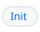

# Header lab

Generated by `make docs.headers` from [headers.toml](headers.toml); edit the spec, not this page.

| # | layout | what it is |
| --- | --- | --- |
| V1 | [Spacer table](#v1) | the README's current form: a two-cell table stretched by a zero-height image |
| V2 | [SVG float](#v2) | a title svg floated left, a button svg per link floated right, a clear, then a one-pixel rule stretched like the spacer |
| V3 | [Plain](#v3) | a markdown heading and a right-aligned paragraph of links under it |

## V1: Spacer table

<table width="100%">
  <tr>
    <td nowrap><h3>Special Guests</h3></td>
    <td align=right><a href="../README.md#engine-api">Engine API</a> | <a href="../README.md#tool-mode">Tool</a> | <a href="../README.md#eval-mode">Eval</a> | <a href="../README.md#interpreter-mode">Interpreter</a> | <a href="../README.md#bridge-mode">Bridge</a> | <a href="../README.md#misc-examples">Examples</a></td>
  </tr>
</table>

Body text under the header, so the spacing to the next paragraph shows.

<table width="100%">
  <tr>
    <td nowrap><h3>Engine API</h3></td>
    <td align=right><a href="../README.md#engine-literals">Literals</a> | <a href="../README.md#engine-reference">Reference</a> | <a href="../README.md#extended-grammar">Grammar</a></td>
  </tr>
</table>

Body text under the header, so the spacing to the next paragraph shows.

<table width="100%">
  <tr>
    <td nowrap><h3>Interpreter Mode</h3></td>
    <td align=right><a href="../README.md#lua">lua</a> | <a href="FFI.md#persistent-state">Persistent state</a> | <a href="FFI.md#init">Init</a></td>
  </tr>
</table>

Body text under the header, so the spacing to the next paragraph shows.

<table width="100%">
  <tr>
    <td nowrap><h3>Bridge Mode</h3></td>
    <td align=right><a href="FFI.md#the-guest-handle">Guest handle</a> | <a href="FFI.md#registering-make-functions">Functions</a> | <a href="FFI.md#hooks">Hooks</a></td>
  </tr>
</table>

Body text under the header, so the spacing to the next paragraph shows.

<table width="100%">
  <tr>
    <td nowrap><h3>Misc Examples</h3></td>
    <td align=right><a href="../README.md#awk-jq">awk and jq</a> | <a href="../README.md#s7">s7</a> | <a href="../README.md#micropy">micropy</a> | <a href="../README.md#js">js</a> | <a href="../README.md#wasm">wasm</a></td>
  </tr>
</table>

Body text under the header, so the spacing to the next paragraph shows.

## V2: SVG float

<a href="../README.md#special-guests"><picture><source media="(prefers-color-scheme: dark)" srcset="img/hdr/special-guests.title.dark.svg"></picture></a><a href="../README.md#engine-api"><picture><source media="(prefers-color-scheme: dark)" srcset="img/hdr/special-guests.0.dark.svg"></picture></a><a href="../README.md#tool-mode"><picture><source media="(prefers-color-scheme: dark)" srcset="img/hdr/special-guests.1.dark.svg"></picture></a><a href="../README.md#eval-mode"><picture><source media="(prefers-color-scheme: dark)" srcset="img/hdr/special-guests.2.dark.svg"></picture></a><a href="../README.md#interpreter-mode"><picture><source media="(prefers-color-scheme: dark)" srcset="img/hdr/special-guests.3.dark.svg"></picture></a><a href="../README.md#bridge-mode"><picture><source media="(prefers-color-scheme: dark)" srcset="img/hdr/special-guests.4.dark.svg"></picture></a><a href="../README.md#misc-examples"><picture><source media="(prefers-color-scheme: dark)" srcset="img/hdr/special-guests.5.dark.svg"></picture></a>

 
<picture><source media="(prefers-color-scheme: dark)" srcset="img/hdr/rule.dark.svg"></picture>

Body text under the header, so the spacing to the next paragraph shows.

<a href="../README.md#engine-api"><picture><source media="(prefers-color-scheme: dark)" srcset="img/hdr/engine-api.title.dark.svg"></picture></a><a href="../README.md#engine-literals"><picture><source media="(prefers-color-scheme: dark)" srcset="img/hdr/engine-api.0.dark.svg"></picture></a><a href="../README.md#engine-reference"><picture><source media="(prefers-color-scheme: dark)" srcset="img/hdr/engine-api.1.dark.svg"></picture></a><a href="../README.md#extended-grammar"><picture><source media="(prefers-color-scheme: dark)" srcset="img/hdr/engine-api.2.dark.svg"></picture></a>

 
<picture><source media="(prefers-color-scheme: dark)" srcset="img/hdr/rule.dark.svg"></picture>

Body text under the header, so the spacing to the next paragraph shows.

<a href="../README.md#interpreter-mode"><picture><source media="(prefers-color-scheme: dark)" srcset="img/hdr/interpreter-mode.title.dark.svg"></picture></a><a href="../README.md#lua"><picture><source media="(prefers-color-scheme: dark)" srcset="img/hdr/interpreter-mode.0.dark.svg"></picture></a><a href="FFI.md#persistent-state"><picture><source media="(prefers-color-scheme: dark)" srcset="img/hdr/interpreter-mode.1.dark.svg"></picture></a><a href="FFI.md#init"><picture><source media="(prefers-color-scheme: dark)" srcset="img/hdr/interpreter-mode.2.dark.svg"></picture></a>

 
<picture><source media="(prefers-color-scheme: dark)" srcset="img/hdr/rule.dark.svg"></picture>

Body text under the header, so the spacing to the next paragraph shows.

<a href="../README.md#bridge-mode"><picture><source media="(prefers-color-scheme: dark)" srcset="img/hdr/bridge-mode.title.dark.svg"></picture></a><a href="FFI.md#the-guest-handle"><picture><source media="(prefers-color-scheme: dark)" srcset="img/hdr/bridge-mode.0.dark.svg"></picture></a><a href="FFI.md#registering-make-functions"><picture><source media="(prefers-color-scheme: dark)" srcset="img/hdr/bridge-mode.1.dark.svg"></picture></a><a href="FFI.md#hooks"><picture><source media="(prefers-color-scheme: dark)" srcset="img/hdr/bridge-mode.2.dark.svg"></picture></a>

 
<picture><source media="(prefers-color-scheme: dark)" srcset="img/hdr/rule.dark.svg"></picture>

Body text under the header, so the spacing to the next paragraph shows.

<a href="../README.md#misc-examples"><picture><source media="(prefers-color-scheme: dark)" srcset="img/hdr/misc-examples.title.dark.svg"></picture></a><a href="../README.md#awk-jq"><picture><source media="(prefers-color-scheme: dark)" srcset="img/hdr/misc-examples.0.dark.svg"></picture></a><a href="../README.md#s7"><picture><source media="(prefers-color-scheme: dark)" srcset="img/hdr/misc-examples.1.dark.svg"></picture></a><a href="../README.md#micropy"><picture><source media="(prefers-color-scheme: dark)" srcset="img/hdr/misc-examples.2.dark.svg"></picture></a><a href="../README.md#js"><picture><source media="(prefers-color-scheme: dark)" srcset="img/hdr/misc-examples.3.dark.svg"></picture></a><a href="../README.md#wasm"><picture><source media="(prefers-color-scheme: dark)" srcset="img/hdr/misc-examples.4.dark.svg"></picture></a>

 
<picture><source media="(prefers-color-scheme: dark)" srcset="img/hdr/rule.dark.svg"></picture>

Body text under the header, so the spacing to the next paragraph shows.

## V3: Plain

### Special Guests

<a href="../README.md#engine-api">Engine API</a> | <a href="../README.md#tool-mode">Tool</a> | <a href="../README.md#eval-mode">Eval</a> | <a href="../README.md#interpreter-mode">Interpreter</a> | <a href="../README.md#bridge-mode">Bridge</a> | <a href="../README.md#misc-examples">Examples</a>

Body text under the header, so the spacing to the next paragraph shows.

### Engine API

<a href="../README.md#engine-literals">Literals</a> | <a href="../README.md#engine-reference">Reference</a> | <a href="../README.md#extended-grammar">Grammar</a>

Body text under the header, so the spacing to the next paragraph shows.

### Interpreter Mode

<a href="../README.md#lua">lua</a> | <a href="FFI.md#persistent-state">Persistent state</a> | <a href="FFI.md#init">Init</a>

Body text under the header, so the spacing to the next paragraph shows.

### Bridge Mode

<a href="FFI.md#the-guest-handle">Guest handle</a> | <a href="FFI.md#registering-make-functions">Functions</a> | <a href="FFI.md#hooks">Hooks</a>

Body text under the header, so the spacing to the next paragraph shows.

### Misc Examples

<a href="../README.md#awk-jq">awk and jq</a> | <a href="../README.md#s7">s7</a> | <a href="../README.md#micropy">micropy</a> | <a href="../README.md#js">js</a> | <a href="../README.md#wasm">wasm</a>

Body text under the header, so the spacing to the next paragraph shows.

